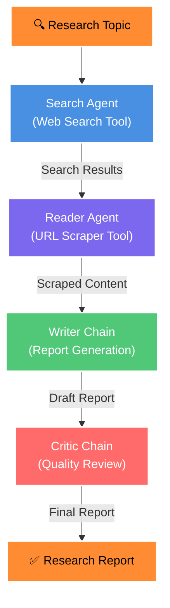

# Multi-Agent Research System

An intelligent AI-powered research system that automatically gathers, analyzes, and synthesizes information to generate comprehensive research reports. Built with LangChain, multiple AI agents, and advanced retrieval pipelines.

## Overview

ResearchMind is a sophisticated multi-agent system that orchestrates specialized AI agents to perform research tasks autonomously. The system combines web search, content extraction, intelligent synthesis, and critical analysis to produce high-quality research reports.

## Architecture



## System Components

### **1. Search Agent**
- Uses `web_search` tool powered by Tavily API
- Finds recent, reliable, and detailed information
- Returns titles, URLs, and content snippets
- Maximum 5 results per search

### **2. Reader Agent**
- Uses `scrape_url` tool for deeper content extraction
- Cleans and extracts text from web pages
- Removes script, style, nav, and footer elements
- Handles errors gracefully with timeout protection

### **3. Writer Chain**
- Generates structured research reports
- Organized into clear sections
- Expert-level writing quality
- Integrates search results with scraped content

### **4. Critic Chain**
- Reviews and validates research output
- Ensures accuracy and coherence
- Provides feedback for improvement
- Quality assurance layer

## Prerequisites

- Python 3.8+
- Streamlit
- LangChain & LangChain Community
- Google Generative AI or OpenAI API key
- Tavily API key
- Internet connection for web searches

## ⚙️ Installation

1. **Clone the repository**
   ```bash
   git clone <repository-url>
   cd Multi-agent-research-system
   ```

2. **Create and activate virtual environment**
   ```bash
   python -m venv myenv
   myenv\Scripts\activate  # Windows
   source myenv/bin/activate  # macOS/Linux
   ```

3. **Install dependencies**
   ```bash
   pip install -r requirements.txt
   ```

4. **Set up environment variables**
   Create a `.env` file in the project root:
   ```
   TAVILY_API_KEY=your_tavily_api_key_here
   GOOGLE_API_KEY=your_google_genai_api_key_here
   # OR
   OPENAI_API_KEY=your_openai_api_key_here
   ```

## Usage

### **Web Interface (Recommended)**
```bash
streamlit run app.py
```
Then open your browser to `http://localhost:8501`

### **Command Line / Pipeline**
```python
from pipelines import run_research_pipeline

topic = "Your research topic here"
results = run_research_pipeline(topic)
```

## Project Structure

```
Multi-agent-research-system/
├── app.py                 # Streamlit web interface
├── agents.py              # Agent definitions & LLM chains
├── tools.py               # Custom tools (web_search, scrape_url)
├── pipelines.py           # Research execution pipeline
├── requirements.txt       # Python dependencies
├── myenv/                 # Virtual environment
└── README.md              # This file
```

## Configuration

### **Switch LLM Provider**

**Using Google Gemini (Default):**
```python
from langchain_google_genai import ChatGoogleGenerativeAI

llm = ChatGoogleGenerativeAI(
    model="gemini-2.5-flash",
    temperature=0.2,
)
```

**Using OpenAI:**
```python
from langchain_openai import ChatOpenAI

llm = ChatOpenAI(
    model="gpt-4o-mini",
    temperature=0,
)
```

## API Keys Required

- **Tavily**: https://tavily.com (web search)
- **Google Generative AI**: https://ai.google.dev (recommended)
- **OpenAI**: https://platform.openai.com (alternative)

## How It Works

1. **Input**: User provides a research topic
2. **Search Phase**: Search Agent queries the web using Tavily API
3. **Extraction Phase**: Reader Agent scrapes and cleans relevant URLs
4. **Writing Phase**: Writer Chain synthesizes findings into a structured report
5. **Review Phase**: Critic Chain validates and improves the output
6. **Output**: Final research report ready for use

## Features

- ✅ Multi-agent orchestration with LangChain
- ✅ Real-time web search integration
- ✅ Intelligent content extraction & cleaning
- ✅ AI-powered report generation
- ✅ Quality review and validation
- ✅ Beautiful Streamlit interface
- ✅ Async support for scalability
- ✅ Error handling and retries

## Error Handling

- Timeout protection for web requests (8 seconds)
- Graceful fallback for URL scraping failures
- Retry logic with Tenacity
- User-Agent rotation for reliability

## UI Features

- Modern dark theme with gradient background
- Responsive design
- Real-time agent progress updates
- Formatted report output
- Custom CSS styling

## Security Notes

- Never commit `.env` files to version control
- Use environment variables for sensitive credentials
- Validate and sanitize external content
- Monitor API usage for cost control

## Technologies Used

- **LangChain**: Agent orchestration & chains
- **Streamlit**: Web interface
- **Tavily**: Web search API
- **BeautifulSoup**: Web scraping
- **Google Generative AI**: LLM backbone
- **Pydantic**: Data validation
- **Requests**: HTTP client


## Troubleshooting

**Issue**: "API key not found"
- Solution: Ensure `.env` file exists with proper API keys

**Issue**: Streamlit not loading
- Solution: Run `streamlit run app.py` from the project root

**Issue**: Web scraping failures
- Solution: Check internet connection and URL validity

**Issue**: Rate limiting on API calls
- Solution: Add delays between requests or upgrade API tier


---

**Built with ❤️ for intelligent research automation**
